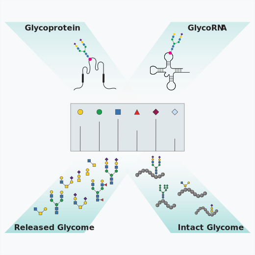
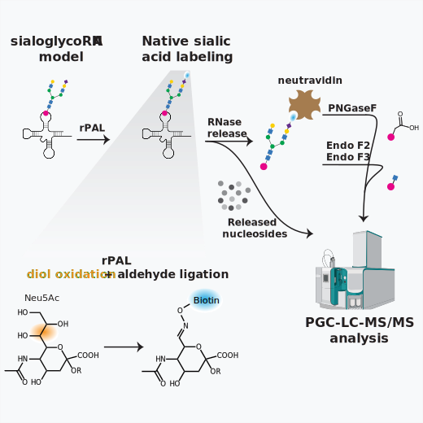

# XieLab
Comprehensive Characterization of Glycosylation Patterns Using Mass Spectrometry

Unraveling Glycan-Mediated Interaction Networks via Chemical Biology Approaches
img/research/Figure2.JPG
Quantitative Mass Spectrometry-Based Epitranscriptomics

