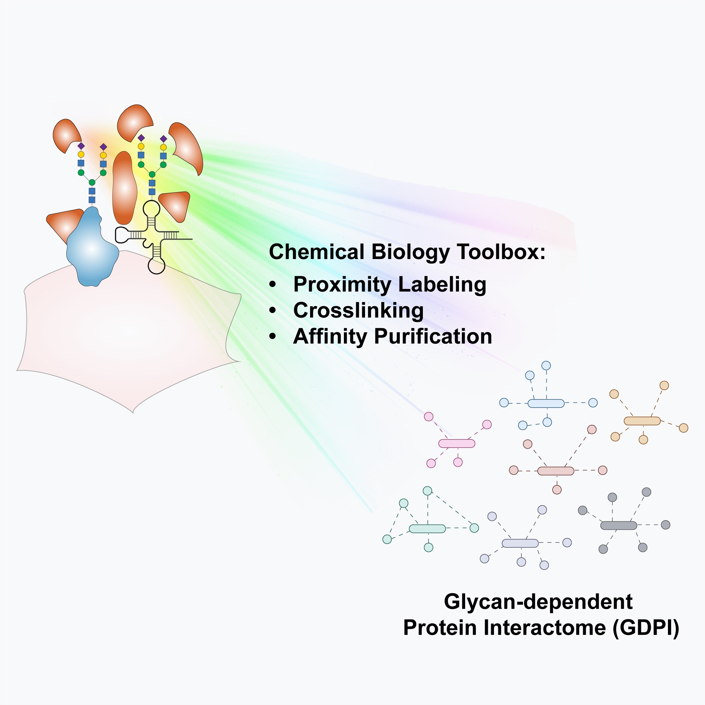

# XieLab
## Research Fields
- ### Comprehensive Characterization of Glycosylation Patterns Using Mass Spectrometry  

---

- ### Unraveling Glycan-Mediated Interaction Networks via Chemical Biology Approaches  

---

- ### Quantitative Mass Spectrometry-Based Epitranscriptomics  

